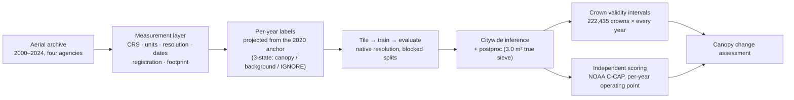

# Edmonds Temporal Tree-Canopy Pipeline

[](https://github.com/Kameron-Eck/edmonds-treedata/actions/workflows/ci.yml)

**A quarter-century tree-canopy assessment for the City of Edmonds, WA** — a binary
canopy mask for every aerial acquisition from 2000 to 2024, produced by per-year
semantic segmentation models fine-tuned from a single hand-annotated 2020 anchor, and
distilled into per-crown *temporal validity intervals* against a fixed layer of
222,435 delineated tree crowns.

Built by Kameron Eck for the City of Edmonds via the Climate Advisory Board, funded by
the Sustainable Path Foundation.

---

## How it works



The archive is difficult on purpose to handle honestly: four projection families (17 of
36 rasters in US survey feet, 13 in Web Mercator), effective resolutions spanning
6.5–81 cm regardless of what the vendors claimed, flights from February to October, and
exactly one year of human-labeled truth. Most of this repository exists to keep those
facts measured, visible, and incapable of silently biasing a statistic.

## Design principles

- **One fact, one home.** Every fact has a single authoritative location; other
  documents link, never restate. Enforced by CI drift gates — because stating the rule
  was not enough (`Scripts/qc/test_docs_match_code.py`).
- **Measured, not assumed.** Imagery geometry, effective resolution, flight dates,
  inter-year registration, and per-year minimum mapping unit are all measured per
  acquisition by dedicated instruments and joined into a single
  [acquisition passport](phase4/qc/acquisition_passport.csv).
- **Honest evaluation only.** Spatially blocked validation, LOSO site splits,
  independent references, per-year operating points — and effects below the measured
  noise floor are reported UNDETERMINED, never "no difference"
  ([the ten-question statistics pre-flight](Scripts/docs/STATS_CHECKLIST.md)).
- **Native resolution is sacred.** The archive is never resampled at rest; cross-year
  statistics compute on a declared analysis grid (EPSG:26910).
- **Reproducible eras.** Every artifact is stamped with commit, seed, architecture, and
  an `EPOCH` marker so re-baselined results are never silently compared across eras.
- **Experiments are pre-registered.** Hypothesis, arms, and the decision rule are
  committed *before* GPUs spin ([`Scripts/experiments/`](Scripts/experiments/README.md)).

## Getting started

```bash
pip install -e .                        # phase4seg engine + shared modules, no path hacks
py -3.12 Scripts/qc/check.py           # the verification ladder: lint → compile →
                                       #   ~530 tests → static preflight → CPU smoke
py -3.12 Scripts/qc/check.py --bench   # + deterministic numerics benchmark (no GPU)
```

Training and inference run on Colab GPUs, driven end-to-end by
`Scripts/pipeline/vm_ops.py` (launch / exec / status / stop with the operational
rules enforced in code) and a resumable, artifact-verifying queue. Imagery and model
artifacts live on a separate data plane and are not part of this repository.

## Repository structure

| Path | Contents |
|---|---|
| `Scripts/pipeline/` | The engine (`phase4seg/`), orchestration, VM ops, shared modules; `builders/` (artifact producers), `frozen/` (phase 0–3 provenance) |
| `Scripts/qc/` | Test suite + drift gates, operational tools; `instruments/` — ~70 measurement scripts |
| `Scripts/experiments/` | Pre-registered experiments: hypothesis, arms, decision rule, verdict |
| `Scripts/docs/` | Data contracts ([SCHEMAS](Scripts/docs/SCHEMAS.md)), the projection census ([CRS_CENSUS](Scripts/docs/CRS_CENSUS.md)), the statistics pre-flight ([STATS_CHECKLIST](Scripts/docs/STATS_CHECKLIST.md)), archive map |
| `phase4/qc/` | Tracked measured outputs: the passport, geometry and registration tables, honest score history |
| `Reports/` | Written deliverables and analysis reports |

## Documentation entry points

1. [`Scripts/CLAUDE.md`](Scripts/CLAUDE.md) — the rulebook and roadmap of where everything lives
2. [`Scripts/WORKPLAN.md`](Scripts/WORKPLAN.md) — intent: the goal, the stage board, open decisions
3. [`Scripts/STATUS.md`](Scripts/STATUS.md) — facts, generated from code + data and gated in CI
4. [`Scripts/docs/REPO_INVENTORY.md`](Scripts/docs/REPO_INVENTORY.md) — the operator's map of every folder, drive, and archived document
5. [`Scripts/Method_Pipeline.md`](Scripts/Method_Pipeline.md) — method, parameters, tiers, loss, QC design
6. [`Scripts/IMAGERY_FACTS.md`](Scripts/IMAGERY_FACTS.md) — the measured imagery record

## Data availability

Source imagery originates from King County, City of Edmonds, Snohomish County, and
USDA NAIP programs and is not distributed with this repository. Derived measurements,
scores, and methods are tracked in full.

---

*Rules → `Scripts/CLAUDE.md` · Intent → `Scripts/WORKPLAN.md` · Facts →
`Scripts/STATUS.md` (generated) · Operations → `Scripts/docs/REPO_INVENTORY.md`*
